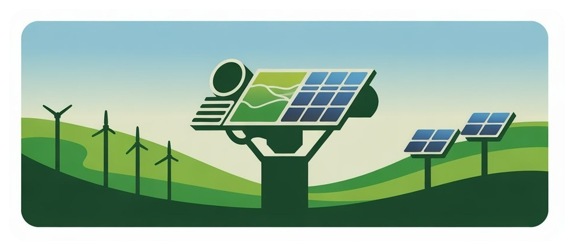

<h1 align="center"><b>Hi, I'm NicoPablo 👋</b></h1>
<!--  -->

<i>"La verdadera belleza es algo que ataca, domina, roba y finalmente destruye"</i> - Yukio Mishima

***💫 About Me!***

Hi! 🎓 I'm a third-year Civil Engineering student specializing in Computer Science and Informatics. I'm passionate about learning new technologies and building my skills across different programming languages and tools.

- 🌱 I'm currently learning...
  - Database Management (SQL)
  - Web Programming
  - Competitive Programming (logic challenges)
  - Software Development MINOR
- 💻 I enjoy working on university projects and exploring new technologies
- 🥋 Outside tech, I practice MMA and other martial arts
- 🎸 I play guitar, mainly rock and metal genres
- 🌍 Languages: Spanish (Native) | English (Intermediate)
- 🤝 Open to collaborate on: University projects | Software Development projects

## My Skills Include

<h4> Languages </h4>
 
  
  
  
  
  
  

<h4> Other Tools and Technologies </h4>

  
  
  
  
  
  
  

## Featured Projects ##

  
  
  
  
  &nbsp;&nbsp;&nbsp;
  

## Check out my Social Media ##

<h2>Github Stats:</h2> 

 
 

---

  <strong>Visitor Count:</strong>
   
  

