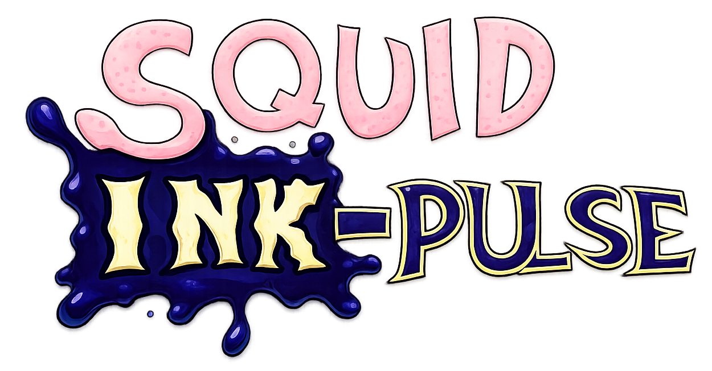
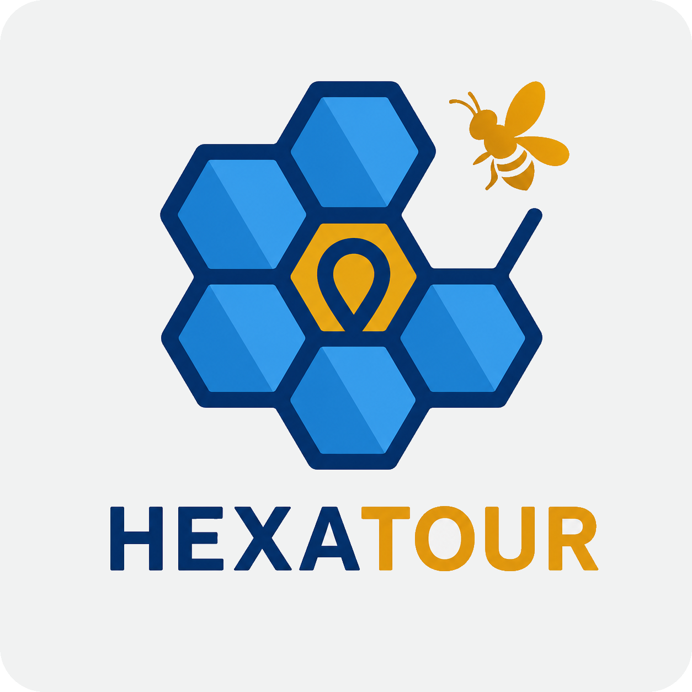
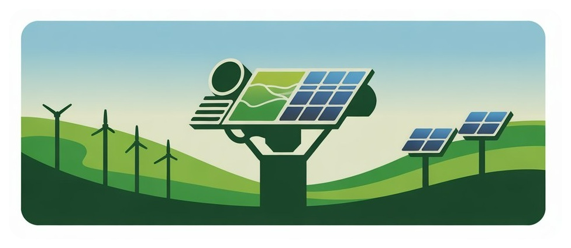

<h1 align="center">
  Hi, I'm NicoPablo 👋  
</h1>

  <em>
    <strong>
      Informatics Engineering student at Universidad Católica del Norte
    </strong> 
    Software Development · Architecture · Embedded Systems · Academic Support
  </em>

  <em>「真の美とは、人を攻撃し、圧倒し、奪い、そして最終的に破壊するものである。」</em> 
  <em>"True beauty is something that attacks, overpowers, robs, and finally destroys."</em> 
  — Yukio Mishima

  <strong>Contact & Social Media</strong>

  
  
  
  
  

## About Me

Hi! I'm an Informatics Engineering student and university teaching assistant interested in software development, programming, system architecture and applied technology projects. I enjoy building academic and personal projects that combine programming, documentation, engineering criteria and technical problem-solving.

- 🌱 Currently learning: 
  - Web development.
  - Competitive Programming.
  - Software architecture.
- 🧩 I enjoy designing structured, maintainable and well-documented systems.
- 🎓 I maintain academic repositories with exercises, solved problems and support material for classmates and students.
- 🥋 Outside tech, I practice MMA and other martial arts.
- 🎸 I play guitar, mainly rock and metal.
- 🌍 Languages: Spanish native | English intermediate.
- 🤝 Open to collaborate on: university projects, software development and engineering-oriented projects.

 

## Skills

### Languages

  
  
  
  
  
  
  
  

### Technologies

  
  
  
  
  
  

### Tools

  
  
  
  
  
  

### Architecture and Documentation

  
  
  
  
  
  

### Methodologies

  
  

## Featured Projects

<table>
  <tr>
    <td width="50%" align="center" valign="top">
      
      <h3>Squid Ink Pulse</h3>
      

        
         
        
      

      
<strong>SCRUM Master & Lead Programmer</strong>

      

        2D single-player endless runner developed in Unity and C#. The player controls a baby squid trying to survive in a hostile underwater environment while chasing its mother.
      

      

        The main mechanic, <strong>Ink-Pulse</strong>, is a risk-reward dash system charged by staying close to danger. My work included gameplay programming, mechanic implementation, sprint organization and technical decision-making.
      

    </td>
    <td width="50%" align="center" valign="top">
      
      <h3>Taller2PSP</h3>
      

        Self-adaptive web system developed in Java using Maven, Javalin and the MAPE-K architectural model.
      

      

        
      

    </td>
  </tr>
  <tr>
    <td width="50%" align="center" valign="top">
      
      <h3>HexaTour</h3>
      

        Offline tourism orientation module using ESP32-S3, Arduino UNO, captive portal and thermal printing.
      

      

        
      

    </td>
    <td width="50%" align="center" valign="top">
      
      <h3>Weather Station</h3>
      

        Low-cost weather and air quality station using ESP32-S3, a Node.js backend and structured technical documentation.
      

      

        
      

    </td>
  </tr>
</table>

## Academic and Teaching Repositories

These repositories are maintained as academic support material for classmates and students. They include exercises, solved problems, teaching notes and course-oriented examples.

<table>
  <tr>
    <td width="50%" align="center" valign="top">
      
      <h3>Programación</h3>
      

        Structured programming and basic logic material: exercises, problem statements and solved programming practice.
      

      

        
      

    </td>
    <td width="50%" align="center" valign="top">
      
      <h3>Programación Avanzada</h3>
      

        Support material for Object-Oriented Programming, Advanced Programming Techniques and Methodologies, and Advanced Programming.
      

      

        
      

    </td>
  </tr>
  <tr>
    <td width="50%" align="center" valign="top">
      
      <h3>Estructura de Datos</h3>
      

        Teaching assistant material with data structure problems, markdown statements and coded solutions.
      

      

        
      

    </td>
    <td width="50%" align="center" valign="top">
      
      <h3>Patrones de Software y Programación</h3>
      

        Software patterns and programming material focused on design, architecture, maintainability and Java-based practice.
      

      

        
      

    </td>
  </tr>
</table>

## GitHub Stats

  

  

  

---

  <strong>Visitor Count</strong> 
  

