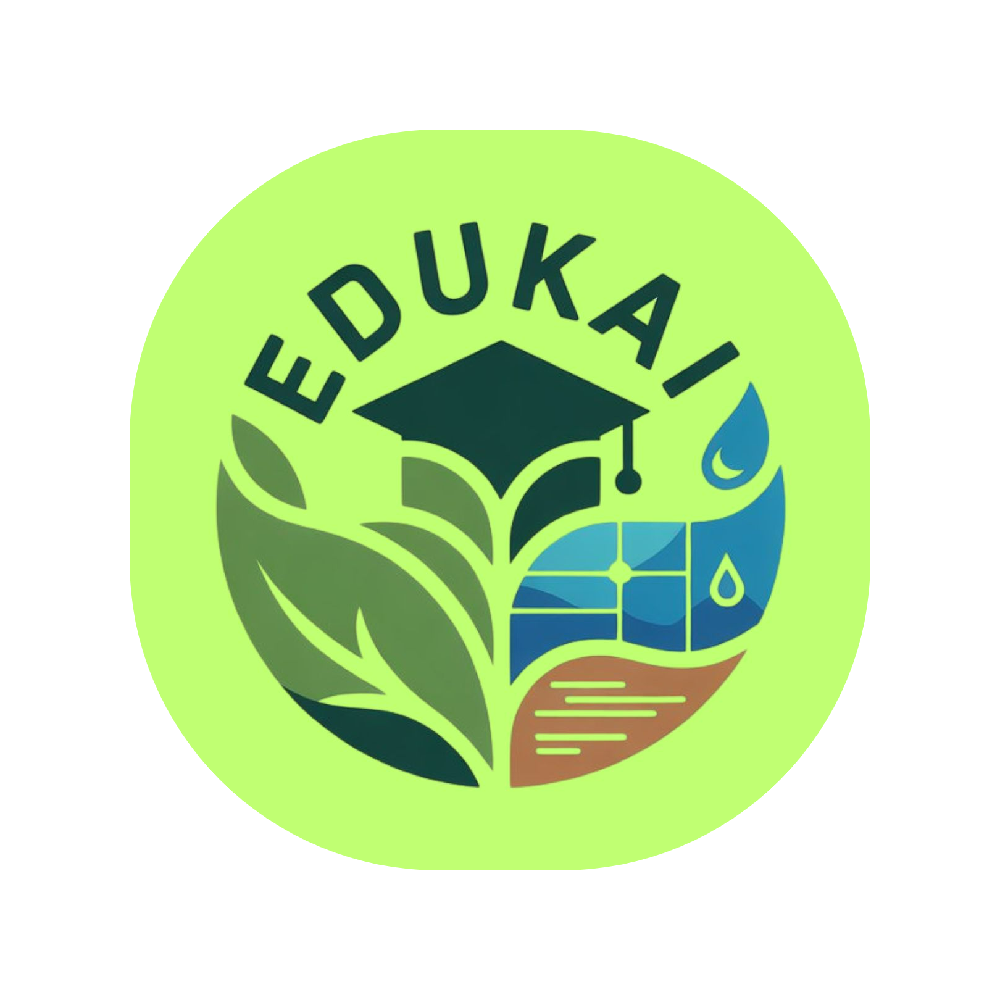

<h1 align="center">
  <b>Hi, I'm NicoPablo 👋</b>
  
</h1>

  
  真の美とは、人を攻撃し、圧倒し、奪い、そして最終的に破壊するものである。」
  
  
    <i>
    "Shin no bi to wa, hito o kōgeki shi, attō shi, ubai, soshite saishū-teki ni hakai suru mono de aru." 
    </i>
  

  
    <i>
      "True beauty is something that attacks, overpowers, robs, and finally destroys." 
    </i>
  
  
    <i>
    "La verdadera belleza es algo que ataca, domina, roba y finalmente destruye." 
    </i>
  

  
    - Yukio Mishima
  

***💫 About Me!***

Hi! 🎓 I'm a third-year Civil Engineering student specializing in Computer Science and Informatics. I'm passionate about learning new technologies and building my skills across different programming languages and tools.

- 🌱 I'm currently learning...
  - Web Programming
  - Competitive Programming (logic challenges)
  - Software Development & Architecture
- 💻 I enjoy working on university projects and exploring new technologies
- 🥋 Outside tech, I practice MMA and other martial arts
- 🎸 I play guitar, mainly rock and metal genres
- 🌍 Languages: Spanish (Native) | English (Intermediate)
- 🤝 Open to collaborate on: University projects | Software Development projects

## My Skills Include

<h4>Languages</h4>

 
  
  
  
  
  
  
  
  
  

<h4>Other Tools and Technologies</h4>

  
  
  
  
  
  
  
  
  
  
  
  

<h4>Architecture & Documentation</h4>

  
  
  
  
  

## Featured Projects

<table>
  <tr>
    <td width="50%" align="center">
      
       
      <h3>Squid Ink Pulse</h3>
      
        
      <strong>SCRUM Master & Lead Programmer</strong>
       
      
        2D single-player endless runner developed in Unity and C#, focused on a baby squid trying to survive 
        in a hostile underwater environment while chasing its mother.
      
        
      
        The main mechanic, <strong>Ink-Pulse</strong>, is a risk-reward dash system charged by staying close to danger. 
        The gameplay loop is based on evading obstacles, taking calculated risks, charging the ability and using it 
        at critical moments.
      
        
      
        My work included gameplay programming, core mechanic implementation, sprint organization, task tracking, 
        SCRUM coordination and technical decision-making during development.
      
    </td>
</table>
<table>
    <td width="50%" align="center">
      
       
      <strong>Taller2PSP</strong>
       
      
        Self-adaptive web system developed in Java using Maven, Javalin and MAPE-K architecture.
      
    </td>
  </tr>
</table>
<table>
  <tr>
    <td align="right">
      <td width="50%" align="center">
        
         
        <strong>HexaTour</strong>
         
        
          Offline tourism orientation module using ESP32-S3, Arduino UNO, captive portal and thermal printing.
        
      </td>
    </td>
    <td align="left">
      <td width="50%" align="center">
        
         
        <strong>Weather Station</strong>
         
        
          Low-cost weather and air quality station using ESP32-S3, Node.js backend and technical documentation.
        
      </td>
    </td>
  </tr>

<!--

  

-->

</table>

## Academic & Teaching Repositories

- 📚 **Data Structures Teaching Material:** C++ exercises, problem statements and solutions for university-level data structures.
- 🧠 **Advanced Programming:** Java, object-oriented programming, programming techniques and academic problem-solving.
- 🧩 **Software Patterns:** Java projects focused on software design, architecture and maintainability.
- 📝 **Technical Documentation:** Reports, diagrams and structured documentation for academic and engineering projects.

## Check out my Social Media

<h2 align="center">GitHub Stats</h2>

  

  

  

---

  <strong>Visitor Count:</strong>
   
  

